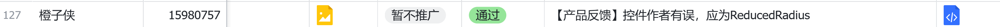

# 数据

2025.7.23收集
这是作者目前能够获得的控件下载数据，根据 https://open.lihouse.xyz/ye#/archieve 和*coco中控台内部人员* 的有关数据反复整理校正得到。**下载量并不等于控件导入的作品量！而是与控件接受程度正相关。**

2025.9:
|控件类型名|次数|
|-------|---|
|SCROLL_SENSOR_WIDGET|50|
|CANVAS_RECORDABLE_WIDGET|39|
|REACT_HTML_DOM_SCRIPT|38|
|IMG|37|
|GRAPHICAL_CLIPBOARD_WIDGET|36|


2025.8截取数据表(从控件发布到8月截取数据)：

|控件名|WIDGET_TYPE|发布时间|下载次数（数据时间）|
|---|----|-----|----|
|地理位置获取|GEO_GETTER_WIDGET|2023-04-01 12:00|2462(25.7.19)|
|滑动感应控件|SCROLL_SENSOR_WIDGET|2023-06-22 19:00|1709(25.8.30)|
|实时画面|CAMERA_REALTIME_WIDGET|2024-07-28 19:00（1.0.3）|299（25.8.11）|
|图表控件|DR_CHART_WIDGET|2023-8-2|101|
|鼠标指针控件|CURSOR_WIDGET|2023-10-3|1078（25.8.23）|
|*摄像机*|CAMERA_MEDIA_WIDGET|2024-2|2311(25.7.19)|
|高级HTTP请求|HTTP_ADDONS_WIDGET|2023-7|114（25.8.11）|
|图片美化控件|IMG(不规范)|2022-12-12|264(2025.8.29)|
|时间戳工具库|LUNAR_TIME_STAMP_CONVERTER|2024-2-6|36(25.8.11)|
|视频播放器PLUS|UNSAFE_EXTENSION_BR_VIDEO|2023-6|455（25.8.11）|
|录音机|RECORDER_WIDGET|2023-4|205（25.8.11）|
|代码编辑器|CODE_EDITOR_WIDGET|2023-6-15|199(25.8.11)|
|React渲染积木|REACT_HTML_DOM_SCRIPT|2022-11-19|226（25.8.23）|
|HTML元素生成控件|HTML_ADDONS_GEN_WIDGET|2023-8-7|229（25.8.23）|
|可录制画布|CANVAS_RECORDABLE_WIDGET|2023-5|230(25.8.23)|
|antd通告栏控件|ANTD_NOTICE_WIDGET|2023-8|225(25.8.23)|
|高级图像工具|GRAPHICAL_CLIPBOARD_WIDGET|2023-7-10|263（25.8.30）|

斜体注明：
*旁观者JErS,ReducedRadius共改的控件，佚名著。*
展示量仅为粗略下载量，实际可能偏少（尤其是粗体）。

他人评价：

<br /><br />


<br /><br />


## 控件有关应用及其分析

1. 助力运动会计时器

注：下列均为公开信息
<br />
一夜知见：<br />
感谢你做出了那么多绝妙的功能控件，有些控件我感觉简直是为我写的，太好了👍👍👍我用你的控件写的运动会视频计时系统，获得了省科技创新成果一等奖<br />


-------

新闻报道(2024.1.2)
链接：https://www.jjcbw.com/v2/news/article/301586.html
**喜报！柴桑小学叶明杰教师参加第38届江西省青少年科技创新大赛终评展示活动荣获一等奖**

引文1：
[使用链接](https://coco.codemao.cn/editor/player/225097862?channel=h5)
近日，由省科协、省科技厅、团省委和省妇联联合主办的第38届江西省青少年科技创新大赛终评展示活动在省科技馆举行。经各设区市评选上报和省赛初评，<br />本届大赛共有140个青少年科技创新成果、30项科技辅导员创新成果参加全省终评展示活动。<br />柴桑小学叶明杰老师制作的《径赛发令计时系统》在第38届江西省青少年科技创新大赛荣获辅导员创新教育成果一等奖。（作者推测：第7名？）


径赛发令计时系统由电子发令器、视频计时器两个客户端组成。发令端发出起跑指令，通过互联网连接技术，计时端收到指令，播放起跑枪声并让计时器同步启动自动开始计时，解决了传统人工计时需手工按下按钮开始计时的短板。<br />计时完成后，发令员端会收到提醒，无需传统的发令员和计时员之间的摇旗吹哨互动。通过视频回放逐帧读取名次和成绩，比赛结果毫无争议。展示现场也吸引了众多的评委嘉宾来体验。此系统可同时进行多场比赛计时任务，这将让广大基层单位运动会工作从此变得轻松高效。


---
涉及控件：
滑动感应控件（UNSAFE_EXTENSION_SCROLL_SENSOR_WIDGET）;<br />
实时画面（UNSAFE_EXTENSION_CAMERA_REALTIME_WIDGET）;<br />
屏幕高级设置（UNSAFE_EXTENSION_SCREEN_SETTINGS_WIDGET）；<br />
“逆向”证据(使用bcmc直接载入编辑器即可)：


---

软件说明：
本系统旨在让广大基层单位实现运动会全流程电脑自动化。系统在多个区级运动会和基层单位使用，均获高度好评。获得江西省科技创新成果一等奖和国家计算机软件著作权利。仅需手机和平板电脑即可搭建专业的电计系统：普及版支持视频录像计时、成绩即时公示功能。高级版支持运动会在线报名、电脑自动分组编排、在线比赛检录、在线径赛|田赛成绩录入、自动视频录像、自动统计成绩排名等功能。

引用2：
https://tt.jxnews.com.cn/news/2334751

标题：浔阳区小学生田径运动会圆满落幕

此届田径运动会历时2天，来自全区14所学校近300名小运动员参加了短跑、长跑、跳高、跳远等21个赛项。各校的小运动员在赛场上挥洒汗水，展现了良好精神面貌。此届运动会，小运动员共打破4项次区田径运动会记录，其中来自浔阳小学的冯子霖打破了800米和1500米2项记录。

　　**值得一提的是，此次运动会采用柴桑小学叶明杰研发的径赛电子化发令计时系统，避免了原有的人工计时产生的误差和争议，使竞赛更加公平、公正、规范。**

　　此次田径运动会，同学们锻炼了身体，提升了技能，培养了竞争意识和团队合作精神。


<br />


2. 拿来给他人二创 (? 




# 控件有关对话存档（凡是不确定讨论对象是否为ReducedRadius的均不列出）
## 对话1：
登登_:emmmmmm 拍照获取图片链接有问题！！！ 还有，可以录制视频吗 就是一小段一小段的进行录制，然后传到云端，做到直播的那种效果<br />
ReducedRadius回复登登_：下拉菜单写错了(,将在新版本中修复<br />
--4天后（23.8.17）--<br />
登登_回复ReducedRadius：修好了吗<br />
ReducedRadius回复登登_：新版本早出来了<br />
<br />


## 对话2：2023-1-19

<br />

ReducedRadius回复Foxtea233_半退：JS控件已做好:*已失效链接* 

<br />

Foxtea233_半退回复ReducedRadius：谢谢<br />
2023-01-29<br />

Foxtea233_半退回复ReducedRadius：我刚搭好网站，你也发了:f.myblog.asia 奇怪的缘分<br />

## 对话3

WCF飞飞N0MT小号：<br />
我使用Waddle（其实是为了方便，我会JS）做了个【增强网页框】，解决了原生网页框无法在框架内打开新网页的问题（想必做浏览器的都深有感受吧）。【开始加载】事件有些问题，望各位大佬能给看看。源代码如下：<br />

```js
const types = {
  isInvisibleWidget: false,
  type: "WCF_SAMEFRAME_PAGEBOX_WIDGET",
  icon: "<被屏蔽>",
  title: "增强网页框",
  version: "1.0.0",
  isGlobalWidget: false,
  properties: [
    {
      key: '__width',
      label: '宽度',
      valueType: 'number',
      defaultValue: 360,
      blockOptions: {
        generateBlock: false,
      },
    },
    {
      key: '__height',
      label: '高度',
      valueType: 'number',
      defaultValue: 200,
      blockOptions: {
        generateBlock: false,
      },
    },
    {
      key: '__size',
      label: '',
      valueType: 'number',
      defaultValue: 0,
      readonly: true,
      blockOptions: {
        setter: {
          keys: ['__height', '__width'],
        },
        getter: {
          keys: ['__height', '__width'],
        },
      },
    },
  ],
  methods: [],
  events: [],
};

class Widget extends VisibleWidget {
  constructor(props) {
    super(props);
    this.__width = props.__width;
    this.__height = props.__height;
    this.widgetLog('WCF匠心制作【增强网页框】，开源免费，使用或再创作需注明作者为【WCF】。');
  this.url=props.url;

  }
  render() {
    return(
      React.createElement("iframe", {  style: {  width: (this.__width),
        height: (this.__height),
      },
      src: (this.url),
      target: "_self",
      onLoadStart: this.onLoadStart.bind(this),
      onLoad: this.onLoad.bind(this),
      onError: this.onError.bind(this),
    }, null)
  );

  }
}

types['properties'].push({
    key: 'url',
    label: 'URL',
    valueType: 'string',
    defaultValue: '喵喵喵',

})

types['events'].push({
    key: 'onLoadStart',
    label: '开始加载',
    params: [],

})
Widget.prototype.onLoadStart = function (event) {
      this.emit("onLoadStart");
}

types['events'].push({
    key: 'onLoad',
    label: '加载完成',
    params: [],

})
Widget.prototype.onLoad = function (event) {
      this.emit("onLoad");
}

types['events'].push({
    key: 'onError',
    label: '加载失败',
    params: [],

})
Widget.prototype.onError = function (event) {
      this.emit("onError");
}

exports.types = types;
exports.widget = Widget;
```

ReducedRadius曰 :onload是全局事件，onloadstart是视频音频标签的**特有**事件<br />

ReducedRadius：还有iframe没有target属性<br />
2023-02-20回复<br />

ReducedRadius回复ReducedRadius：iframe没有设置sandbox属性，导致很多权限会被阻止<br />
2023-02-20回复<br />

WCF飞飞N0MT小号回复ReducedRadius：？？？iframe是有target属性的呀<br />
2023-02-20回复<br />

WCF飞飞N0MT小号回复ReducedRadius：的确，谢谢提醒<br />
2023-02-20回复<br />

ReducedRadius回复WCF飞飞N0MT小号：只是超链接存在<br />
2023-02-21<br />

## 对话4

2025年8月1日

ReducedRadius(R):你找到的是哪个控件？<br />
一夜知见(一夜)：就是播放器plus那个控件.但是这个控件有点小错误，实时播放进度读取不了，还记得我重金求修复吗？
您是我的大神啊，我的程序基本上都用到了您的控件 {花朵*3}<br />
R：找到错误了，是原来的方法没对上<br />
一夜: 08-01 09:18:07<br />
是您的一个小疏忽[呲牙]<br />

一夜: 08-01 09:19:01<br />
这个播放器太牛了，我用他写出了逐帧播放器[可爱]<br />

...<br />
一夜：
9:34
不愧是大神，分分钟就修复了控件bug,而且马上找到小程序的漏洞👍 <br />
你在读大学，毕业了吗?<br />
R:？我还是准高三呢

(然后作者开学跑路la~)