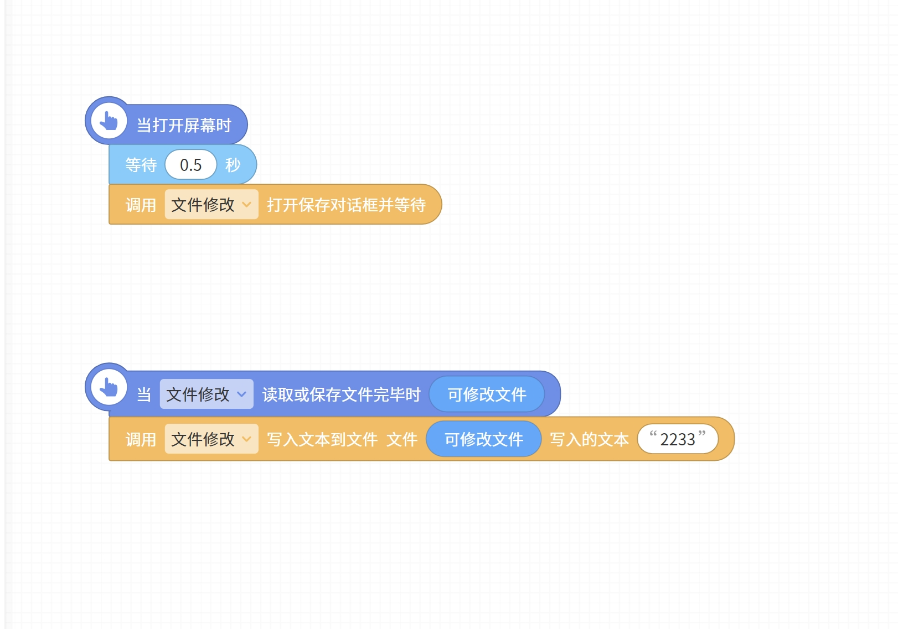
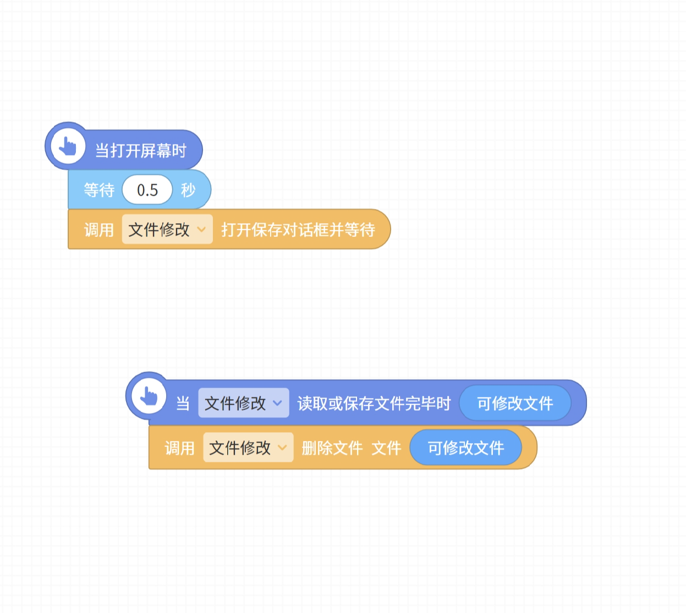

# 控件存档
[下载控件](https://static.codemao.cn/bcxcocojs/rkNakAeQn?hash=FkqoH0J34OcIxz3J8jbTEwJuevoZ)
[本网页控件备份](/widget/file.js)
[File System API参考文档](https://developer.mozilla.org/zh-CN/docs/Web/API/File_System_API)

# 控件注意事项
2023年4月25日修改控件

1. 注意：本控件只适用于电脑端，且要求极高，必须是Chrome最新版（110）才可使用！！！;
2. 控件在其它非Win32/64操作系统上可能有所差异。

# 控件文档-方法

1. 此处"文件"定义

此处文件相当于一个不可修改的字典；不可通过任何方法直接进行上传（包括但不限于云字典，云数据库，HTTPS请求等）； 
也不可通过本地存储进行储存；‘文件夹’也使用如此，并且文件夹需获取内部文件后方可读取
 

2. 方法：请求打开文件
不显示‘所有’文件：是/否；(布尔值);即在打开过程中不显示所有文件 
文件类型(MIME Type)描述：<文本>；(string),打开时展示的文本（JS文件:'text/javascript'等...） 
文件类别:似乎没有非常大的作用?在某些情况决定打开文件类别 
文件扩展名列表：<文本>.png,.gif ...每个扩展名打一个逗号 
 

3. 方法:删除文件（此处文件：即可操作文件）
注意：这将删除文件，删除会提醒您一次，删除后不可挽回！
 

4. 方法：读取为资源数据链接（文件）
该方法在读取完之后触发修改成功事件；数据链接可作为视频框的视频(音频链接也可以插入)，图片框的图片；
 

5. 方法：读取为文本（文件 ）
该方法类似于文件工具箱的打开
 

6. 方法：打开保存对话框并等待
这将弹出一个"另存为"对话框，请求用户保存文件
 

7. 方法：写入文本/图像到文件（文件：可操作文件；写入的文本：文本）
上述两种方法都可以写入常规文件到文本，写入将会立刻保存；注意：下者除了写入图像，还可以写入音频，视频等！
 

8. 方法：是否支持使用本控件;
由于控件的冒险性，可能会遇到无法支持状况，建议试一试该方法再使用其他方法
 

9. 方法：两个文件是不是一样的？（文件1，文件2）；
判断两者是否完全相同
 

10. 方法：获取文件名称（文件/文件夹）；
此处名称指为文件名，也可以是文件夹名称

11. 请求读取目录并返回文件列表；
打开目录后访问并输出一个coco标准列表（第几项）；内有文件和文件夹(不是字符串类型!)

12. 方法：这个资源是文件夹？（资源）；
可判断是否为文件夹

13. 方法：打开文件夹并读取里面文件和目录；
输出：文件列表；
用法：如果打开文件夹后还有文件夹，使用该方法读取里面的文件（禁止套娃（bushi））；

14. 方法：获取文件夹中命名的文件（文件夹，将要获取的名称）；获取文件夹内名为/什么的文件并输出

15. 专业方法：写入二进制数据到文件；
（文件，写入内容列表）;

> 写入内容列表：例如：255,3,114,51,4...这样组成的列表（每个数值必须为0-255间整数，否则报错）

# 事件积木

1. 事件：读取或保存文件完毕；
当执行打开文件或保存文件完毕时触发；
参数类型：可修改文件 --- 任何类型；
（FileSystemFileHandle）

2. 事件：修改操作成功；
输出结果：即读取后结果或某些完成消息；
来源：将输出操作具体名称

3. 事件：修改操作失败；
错误信息：若非专业，则理解起来比较复杂，即代码运行时发生的错误信息
（可能：权限不许可等）

# 几个简单示例

1. 下列示例提供一个简单的写入文件方法:

2. 下列示例**在用户允许条件下**删除文件

3. 如何临时存储"可操作文件"?
使用变量存储可操作文件,才可与另一文件进行比较