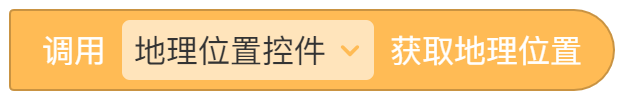

# 补充
精确度：0.0001,海拔经作者测试未提供。
 经coco内部人员统计，截至2025.7.20，此控件使用次数为**2462**

# 控件说明
标识：GEO_GETTER_WIDGET
代码上次修改时间:2023/04/01<br />
目的:获取经纬度信息（需要权限允许才能使用）<br />

存储于:[控件商城](https://static.codemao.cn/appcraft/extension-widgets/production/geo-getter.js?t=0.983570838299896)

# 使用方法

使用下图所示积木,连接后可以使用两块事件积木获取成功返回和失败返回内容(为保险,两块最好都用)


> 注意,即便在现在(2025年),控件作者还是只能保证获取纬度和经度,其它信息尚不明确。若要获取海拔等数据,请使用外部api。


# 错误代码 错误消息

错误代码 

|代码|含义|
|---|------|
|1|无位置权限(需要给予)|
|2|无法获取位置(无法定位)|
|3|获取超时|

> **错误消息为纯英文**

附注：
控件内容：<br />
2025/7/24官方修改版<br />


```js

var navigator = this.window.parent.navigator;
const types = {
  version: "1.0.0",
  icon: "https://static.codemao.cn/appcraft/extension-widgets/production/geo-getter.svg",
  title: "地理位置控件",
  type: "GEO_GETTER_WIDGET",
  isInvisibleWidget: true,
  isGlobalWidget: false,
  properties: [],
  methods: [
    {
      key: "GEO",
      label: "获取地理位置",
      params: [],
    },
  ],
  events: [
    {
      key: "SUCCESS",
      label: "成功",
      params: [
        {
          key: "a",
          label: "纬度",
          valueType: "number",
        },
        {
          key: "b",
          label: "经度",
          valueType: "number",
        },
      ],
    },
    {
      key: "FAIL",
      label: "获取失败",
      params: [
        {
          key: "errcode",
          label: "错误代码",
          valueType: "string",
        },
        {
          key: "info",
          label: "错误信息",
          valueType: "string",
        },
      ],
    },
  ],
};

class Widget extends InvisibleWidget {
  constructor(props) {
    super(props);
  }

  GEO() {
    var _this = this;
    navigator.geolocation.getCurrentPosition(
      function (e) {
        _this.emit("SUCCESS", e.coords.latitude, e.coords.longitude);
      },
      function (e) {
        _this.emit("FAIL", e.code, e.message);
      }
    );
  }
}

exports.types = types;
exports.widget = Widget;

```

*Original Version：*


```js
var navigator = this.window.parent.parent.navigator;
const types = {
    version:"1.0.0",
    icon: "https://creation.codemao.cn/716/appcraft/IMAGE_Ucte8Y7kD_1680320771981.png",
    title: "地理位置控件",
    type:"GEO_GETTER_WIDGET",
    isInvisibleWidget: true,
    isGlobalWidget: false,
    properties:[],
    methods: [{
        key:"GEO",
        label:"获取地理位置",
        params:[]
    }],
    events: [{
        key:"SUCCESS",
        label:"成功",
        params:[{
            key:"a",
            label:"纬度",
            valueType:"number"
        },{
            key:"b",
            label:"经度",
            valueType:"number"
        }]
    },{
        key:"FAIL",
        label:"获取失败",
        params:[{
            key:"errcode",
            label:"错误代码",
            valueType:"string"
        },{
            key:"info",
            label:"错误信息",
            valueType:"string"
        }]
    }],
}

class Widget extends InvisibleWidget {
    constructor(props) {
        super(props);
        
    }

     GEO(){
        var _this  = this;
      navigator.geolocation.getCurrentPosition(function(e){
        _this.emit("SUCCESS",e.coords.latitude,e.coords.longitude)
      },function(e){_this.emit("FAIL",e.code,e.message)})
    }
}

exports.types = types;
exports.widget = Widget;
```

