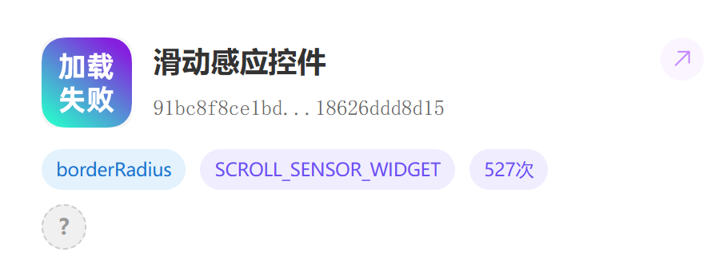

# 滑动感应控件
因控件被发现异常爆火（还有几百次使用），故编著此文档。
<br />

**控件状态:**
该控件于2025年8月23日申请提交，29日发现技术方面已通过但未上架。



<a href="/widget/example.json">示例作品（明天的太阳著）</a>

> 更加精确地做出动作反应。
本文档编写于2025.8.3；但是控件自23.6.22以来无任何更新。

本控件只存在事件，不具备任何方法，属性。

1. **滑动幅度较小或即将滑动**
滑动位移(movement)在*x/y*轴方向上绝对值小于8；

2. **滑动压力**
仅适用于手机端与触控板，否则按压压力值为0.5，不按压时为0。

3. **X端滑动分量，Y轴~**
即滑动通过的像素点个数。

源代码（非投稿控件商城版本）：
```js
/**
 * Made by DashedRadius,2023年6月22日
 * 本控件为原创,请勿未经同意篡改并发布!
 */
var document = globalThis.document
const types = {
    isInvisibleWidget: true,
    type: "SCROLL_SENSOR_WIDGET",
    icon: "https://waddle.coco-central.cn/static/img/logo/logo-white.svg",
    title: "滑动感应控件",
    version: "1.0.0",
    author:"borderRadius",
    isGlobalWidget: true,
    properties: [],
    methods: [],
    events: [{
        key:"scrollup",
        label:"向上滑动",
        params:[]
    },{
        key:"scrollleft",
        label:"向左滑动",
        params:[]
    },{
        key:"scrollbelow",
        label:'向下滑动',
        params:[]
    },{
        key:"scrollright",
        label:"向右滑动",
        params:[]
    },{
        key:"micro",
        label:"滑动幅度较小或即将滑动",
        params:[{key:"x",label:"X端滑动分量",valueType:"number"},{key:"y",label:"Y端滑动分量",valueType:'number'}]
    },{
        key:"on",
        label:"滑动",
        params:[{
            key:"pressure",
            label:"压力",
            valueType:"number"
        },{key:"x",label:"X端滑动分量",valueType:"number"},{key:"y",label:"Y端滑动分量",valueType:'number'}]
    }],
};

class Widget extends InvisibleWidget {
    constructor(props) {
        super(props);
        this.down = false
      document.documentElement.onpointerdown = () =>{
         this.down = true
      }
      document.documentElement.onpointerup = () =>{
        this.down = false
      }
      document.documentElement.onpointermove = (e) =>{
        if(this.down){
        this.emit("on",e.pressure,e.movementX,e.movementY)}
        if(e.movementY <-8&&this.down){
           this.emit("scrollup")
        }else if(e.movementX <-8&&this.down){
            this.emit("scrollleft")
        }else if(e.movementY >8&&this.down){
            this.emit("scrollbelow")
        }else if(e.movementX >8&&this.down){
            this.emit("scrollright")
        }else if(this.down){
            this.emit("micro",e.movementX,e.movementY)
        }
      }
    }

}

exports.types = types;
exports.widget = Widget;
```

